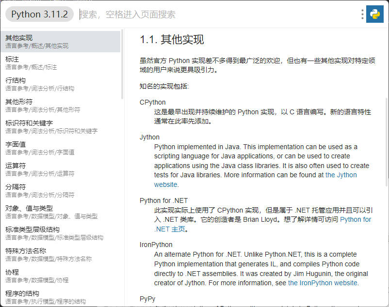
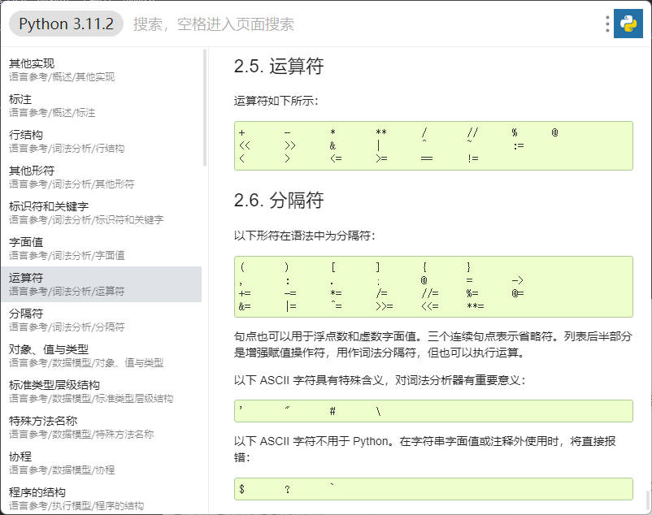

# Python 3.11.2 文档速查插件

## 简介

本仓库是一个utools的文档插件仓库，用于将Python的官方html格式文档（来源参阅[官方文档](https://docs.python.org/zh-cn/3/download.html)）转换为utools兼容的文档插件格式

## 都有什么？

插件包含官方文档的`标准库参考(library)`和`语言参考(reference)`部分，且仍使用Python官方文档主题便于阅读（偷懒）

目录已根据`文档类型/章节名/段落名`的方式进行整理，保留了更加完整的目录结构，对搜索和快速检索更加友好

## 如何使用？

前往utools插件市场，搜索`Python`，在结果页中找到`Python 3.11.2 文档`插件，点击右上角`获取`，即可安装此插件

在utools搜索框中，输入关键词`Python 3.11.2`即可打开本插件（关键词不区分大小写，可模糊输入如`py`）

## 插件截图





## Build Your Own Offline Version

你可以通过以下步骤构建此插件的离线版本（upx插件）:

1. clone此仓库，假设此仓库路径为工作路径

2. 从[官方文档](https://docs.python.org/zh-cn/3/download.html)下载Python的**html版本**文档，例如`python-3.11.2-docs-html.zip`

3. 解压缩下载的zip文件到工作路径，此时文档首页路径应为`工作目录/python-3.11.2-docs-html/index.html`

4. **注意**：在当前版本中，图片文件不会自动移动，请手动将`工作目录/python-3.11.2-docs-html/_images`移动到`工作目录/public/_images`

5. 准备工作环境，在工作目录执行以下命令：

   ```
   pip install beautifulsoup4 # html解析
   pip install rich # 控制台输出
   ```

6. 修改`main.py`中`config`字段以符合你的需求

7. 在工作路径执行`python main.py`以生成插件资源

8. 在utools插件市场搜索安装`uTools 开发者工具`，并新建项目，plugin.json选中`工作目录/public/plugin.json`

9. 在`uTools 开发者工具`插件中，点击`打包`即可获得upx文件